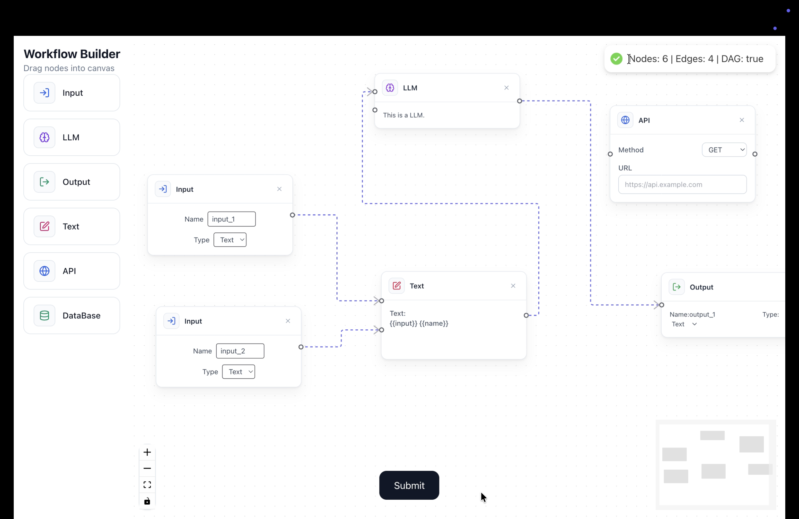

# React Flow Pipeline Builder

A full-stack application that provides a node-based visual editor for constructing pipelines and workflows. Built with **React** (using React Flow) on the frontend and **FastAPI** on the backend.



## 🌟 Features

- **Interactive Node Editor:** Drag-and-drop interface to create and connect nodes using [React Flow](https://reactflow.dev/).
- **Pipeline Parsing:** Submit the graph to the backend to calculate the total number of nodes and edges.
- **DAG Validation:** The backend automatically analyzes the pipeline structure using topological sorting to verify if it forms a valid **Directed Acyclic Graph (DAG)** (i.e., no cyclical dependencies).

## 🛠️ Technology Stack

### Frontend
- **React.js** (v18)
- **React Flow** (Node-based UI)
- **Tailwind CSS** (Styling)
- **Axios** (API Requests)
- **Lucide React** (Icons)

### Backend
- **FastAPI** (Python web framework)
- **Pydantic** (Data validation)

## 🚀 Getting Started

### Prerequisites
- Node.js & npm
- Python 3.8+

### 1. Backend Setup

Open a terminal and navigate to the backend directory:

```bash
cd backend
```

Create a virtual environment:
```bash
python -m venv venv
source venv/bin/activate  # On Windows use `venv\Scripts\activate`
```

Install the required packages:
```bash
pip install fastapi uvicorn pydantic
```

Start the FastAPI server:
```bash
uvicorn main:app --reload
```
The backend will be running at `http://127.0.0.1:8000`.

### 2. Frontend Setup

Open a new terminal and navigate to the frontend directory:

```bash
cd frontend
```

Install the dependencies:
```bash
npm install
```

Start the development server:
```bash
npm start
```
The frontend application will be running at `http://localhost:3000`.

## 📌 Usage
1. Open the application in your browser.
2. Drag and drop nodes onto the canvas.
3. Connect nodes by dragging from a source handle to a target handle.
4. Submit the pipeline to see the analysis from the backend (Node count, Edge count, and DAG status).
